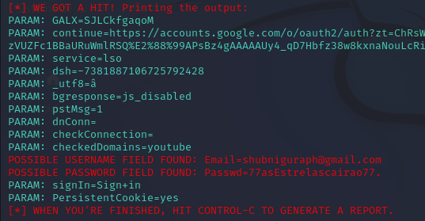

# cibersecurity-desafio-phishing
Desafio propost pela DIO no Bootcamp Santander Cibersecurity, onde foi feito um phishing para captura de senha do google.

### Ferramentas

* Kali Linux
* setoolkit

## Configurando o Phishing no Kali Linux

* Acesso root: ``` sudo su ```
* Iniciando o setoolkit: ``` setoolkit ```
* Tipo de ataque: ``` Social-Engineering Attacks ```
* Vetor de ataque: ``` Web Site Attack Vectors ```
* Método de ataque: ``` Credential Harvester Attack Method ```
* Método de ataque: ``` Web Templates ```
* URL para clone: http://www.google.com

### Resutados
 